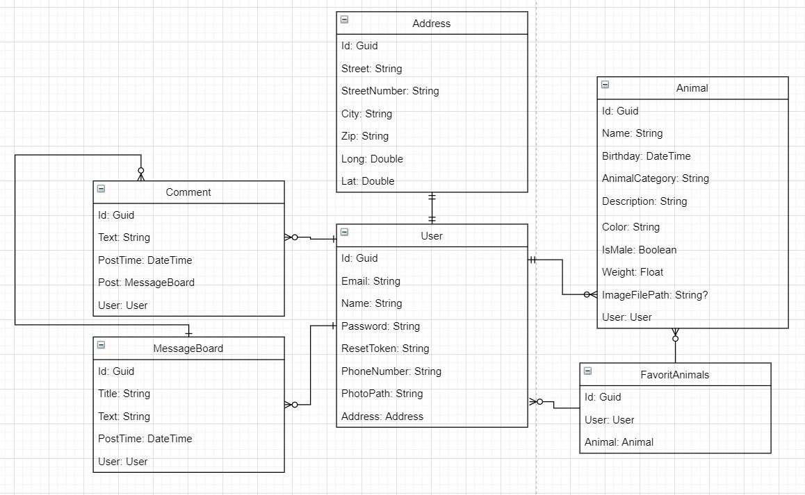

# AdoptApalWebApplication

**Web-Anwendung für Web Engineering 1, entwickelt von Anna-Lisa Merkel und Molham Al-khodari.**

## Was ist AdoptAPal?

AdoptAPal ist eine Web-Anwendung, die dazu dient, Tiere zur Adoption zu finden und die Anbieter zu kontaktieren. Sowohl Anbieter (Privatpersonen, Züchter, Tierheime) als auch Interessenten können die App nutzen. Eine Registrierung ist nur für das Hochladen von Tieren erforderlich, die meisten Funktionen stehen jedoch auch ohne Registrierung zur Verfügung.

## Hauptfunktionen im Überblick

Unsere Plattform bietet eine Fülle von leistungsstarken Funktionen, um dein Erlebnis bei der Tieradoption so reibungslos und erfreulich wie möglich zu gestalten:

### Entdecken und Filtern

-   **Übersichtliche Listenansicht:** Auf unserer Startseite findest du eine gut strukturierte Liste aller hochgeladenen Tiere, die zur Adoption bereitstehen. Diese Liste ermöglicht es dir, einen schnellen Überblick zu behalten.
    
-   **Intelligente Filterfunktion:** Dank unserer fortschrittlichen Filterleiste kannst du die Tierliste nach Kategorien, Geschlecht und Alter filtern, um genau die Tiere zu finden, die deinen Vorstellungen entsprechen.

### Detaillierte Tierprofile

-   **Umfangreiche Profilansicht:** Jedes Tier verfügt über eine detaillierte Profilseite, die umfangreiche Informationen über das Tier und seine Geschichte bietet. Von dort aus kannst du weitere Details erkunden und sogar den Betreuer des Tiers kontaktieren.
    
-   **Verantwortungsbewusste Anbieter:** Wenn du ein Tierprofil besuchst, hast du die Möglichkeit, zum Profil des Betreuers zu navigieren. Dort findest du nicht nur Kontaktinformationen, sondern auch relevante Informationen über den Anbieter sowie seine neuesten Beiträge im Message Board.

### Interaktion und Kommunikation

-   **Kontaktmöglichkeiten:** Durch unsere Plattform kannst du direkt mit Tieranbietern in Kontakt treten und ihnen Fragen stellen. So kannst du sicherstellen, dass du alle Informationen hast, um die richtige Entscheidung zu treffen.
    
-   **Message Board:** Unser Message Board ermöglicht es dir, Beiträge zu schreiben, zu lesen und Kommentare hinzuzufügen. Hier kannst du deine Gedanken teilen, Fragen stellen und wertvolle Informationen von anderen Mitgliedern erhalten.

### Benutzerfreundliches Konto-Management

-   **Registrierung und Anmeldung:** Du kannst dich einfach registrieren und anmelden, um die volle Funktionalität unserer Plattform zu nutzen.
    
-   **Account-Einstellungen:** Die Einstellungsseite ermöglicht es dir, deine Kontoinformationen zu bearbeiten und deine persönlichen Daten zu aktualisieren. Du kannst auch dein Konto sicher löschen, wenn du dies wünschst.
    
-   **Passwortwiederherstellung:** Falls du dein Passwort vergessen hast, bieten wir eine bequeme Funktion zur Passwortwiederherstellung per E-Mail.

### Verwaltung deiner Interaktionen

-   **Meine Tiere:** Unter dieser Rubrik findest du eine Liste der von dir hochgeladenen Tiere. Hier kannst du Tiere bearbeiten oder löschen.
    
-   **Favoritenliste:** Du kannst deine Lieblingstiere markieren und in deiner Favoritenliste speichern, um sie jederzeit schnell wiederzufinden oder bei Bedarf zu entfernen.

### Sicherheit und Zuverlässigkeit

Alle eingegebenen Daten werden sorgfältig validiert und gesichert, um deine Privatsphäre und Sicherheit zu gewährleisten.

## Installationsanleitung

### Schritt 1: Repository klonen

Öffne dein Terminal und führe den folgenden Befehl aus, um das Repository auf deinem lokalen System zu klonen:

    git clone https://git.ai.fh-erfurt.de/adoptapal/adoptapalwebapplication.git

### Schritt 2: Projekt in Visual Studio 2022 öffnen

Navigiere zu dem Ordner, in dem du das Repository geklont hast, und öffne es in Visual Studio 2022.

### Schritt 3: Löschen der Adoptapal-Datenbank

Öffne den SQL Server Object Explorer in Visual Studio und überprüfe, ob die "Adoptapal"-Datenbank vorhanden ist. Falls ja, lösche sie, um mögliche Konflikte zu vermeiden.

### Schritt 4: Datenbankmigration durchführen

Öffne die "Package Manager Console" in Visual Studio und führe den folgenden Befehl aus, um die erforderlichen Datenbankmigrationen durchzuführen:

    Update-Database
    
Du wirst eine Meldung ähnlich der folgenden sehen:

    Build started...
    Build succeeded.
    Applying migration '20230825124708_initial'.
    Applying migration '20230826102219_testData'.
    Done.

### Schritt 5: Anwendung starten

Nach erfolgreicher Migration kannst du die Anwendung starten. Registriere dich, um Zugriff zu erhalten, oder verwende Testdaten, um dich anzumelden und die Anwendung zu erkunden.

Wir hoffen, dass diese Anleitung dir bei der reibungslosen Installation der Anwendung hilft. Bei Fragen oder Problemen stehen wir gerne zur Verfügung. Viel Spaß mit Adoptapal!

## Testnutzer

| Name          | E-Mail                     | Passwort  |
| ------------- | -------------------------  | --------- |
| Hans Meyer    | hans.meyer@fakemail.io     | Test123!  |
| Gabi Schnitzler | gabi.schnitzler@tierheim.de | Test123!  |
| Richard Klöse | richard.kloese@mail.de     | Test123!  |
| Tierheim Katzentempel | katzentempel@tierheim.de | Test123!  |
| Felix Richter | felix.richter@email.com    | Test123!  |

## Aufbau

## Seitenstruktur

Unsere Plattform ist übersichtlich strukturiert und bietet eine Reihe von Seiten, die speziell entwickelt wurden, um deine Tieradoptionserfahrung optimal zu gestalten:

### 1. Startseite (Home)

Die Startseite gibt dir einen schnellen Überblick über die Vielfalt der verfügbaren Tiere. Hier kannst du die Liste der hochgeladenen Tiere durchstöbern und mit den Filteroptionen deine Suche nach bestimmten Tierkategorien, Geschlechtern und Altersgruppen verfeinern.

### 2. Message Board

Das Message Board bietet dir die Möglichkeit, Beiträge zu schreiben, Beiträge von anderen zu lesen und Kommentare zu hinterlassen. Hier kannst du wertvolle Informationen teilen, Fragen stellen und dich mit anderen Tierliebhabern austauschen.

### 3. Einstellungen (Settings)

Die Einstellungsseite erlaubt es dir, deine persönlichen Nutzerdaten zu verwalten. Du kannst deine Kontoinformationen aktualisieren und sicherstellen, dass deine Daten immer auf dem neuesten Stand sind.

### 4. Profil

Die Profilseite bietet einen umfassenden Einblick in deine Aktivitäten auf der Plattform. Hier kannst du nicht nur deine hochgeladenen Tiere anzeigen lassen, sondern auch Informationen zu deinen Kontaktmöglichkeiten und anderen relevanten Details finden.

### 5. Meine Tiere (My Animals)

In diesem Bereich kannst du eine Liste der Tiere anzeigen, die du hochgeladen hast. Du hast die Möglichkeit, diese Tiere zu bearbeiten oder zu löschen, um sicherzustellen, dass die Informationen immer aktuell sind.

### 6. Favorisierte Tiere (Favorite Animals)

Deine Favoritenliste zeigt die Tiere, die du als deine Favoriten markiert hast. Du kannst Tiere von dieser Liste entfernen oder neue hinzufügen, um die Tiere, die dir besonders am Herzen liegen, immer griffbereit zu haben.

### 7. Detailseite / Erstellen / Löschen Tier

Die Detailseite eines Tiers bietet ausführliche Informationen zu diesem Tier sowie Angaben zum zugehörigen Anbieter. Zusätzlich kannst du Tierdaten bearbeiten oder das Tier löschen, sofern du der Eigentümer bist.

### 8. Anmelden (Login) / Registrieren / Passwort vergessen

Die Anmeldeseite ermöglicht es dir, dich in dein Konto einzuloggen, während die Registrierungsseite dir die Möglichkeit gibt, ein neues Konto zu erstellen. Falls du dein Passwort vergessen hast, bieten wir eine bequeme Funktion zur Wiederherstellung.

## Datenbank

## Verwendete Tools und Quellen

- Visual Studio 2022 (IDE)
- Gitlab (Versionsverwaltung)
- drawio (Diagramme)
- Figma (Mockups)
- Open Street Map (Kartenansicht)

## Präsentationen

- [Auftaktpräsentation](documentation/AdoptAPal_Auftaktpräsentation.pdf)
- [Abschlusspräsentation](documentation/AdoptAPal_Abschlusspräsentation.pdf)
